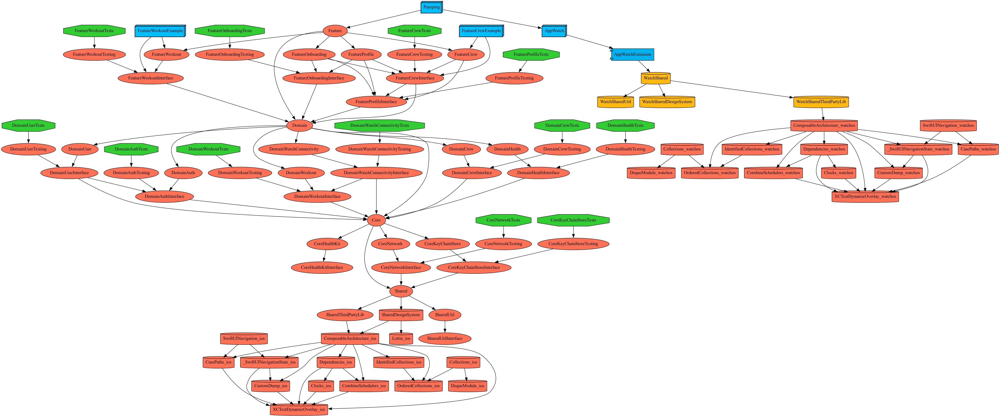

# Pumping

 

# Micro Feature Architecture
대규모 서비스를 위한 마이크로 Feature Architecture를 구성하였습니다. 

시행착오가 많을 예정이어서 블로그에 따로 정리하려고 합니다.

[🚀 블로그](https://medium.com/@mooyoung2309/tuist%EB%A1%9C-micro-architecture-%EC%A0%81%EC%9A%A9%ED%95%98%EA%B8%B0-aa0ca97a4f4d) 도 놀러오세요 !

## 4 Layer
계층 구조는 다음과 같습니다.
- Feature: 기능
- Domain: 모델
- Core: 템플릿
- Shared: 공용 모듈

## Target Type
타겟 타입은 다음과 같습니다.
- Example: 샘플 앱
- Implement: 구현부
- Tests: 테스트
- Testing: 테스트를 위한 목업
- Interface: 인터페이스

## Dependencies Graph
디펜던시 그래프는 다음과 같습니다.

